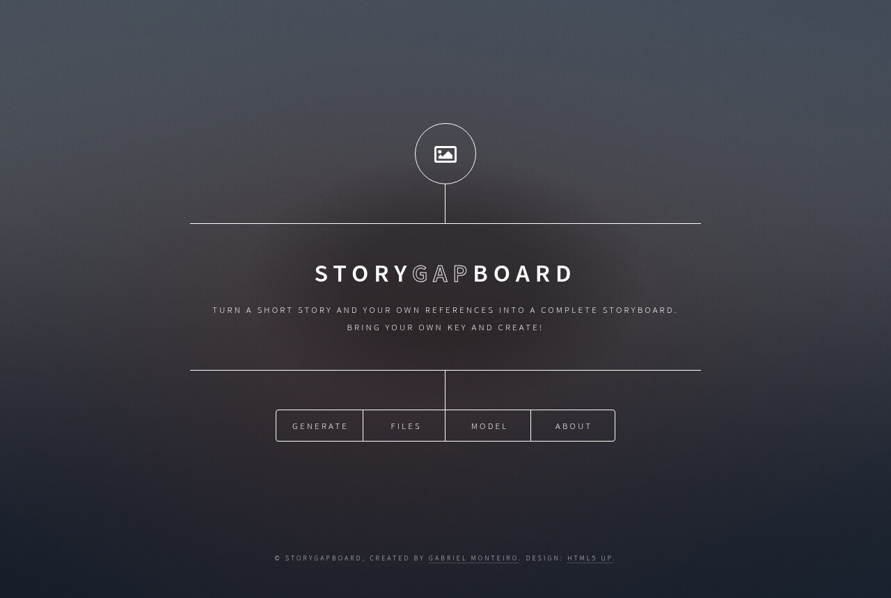
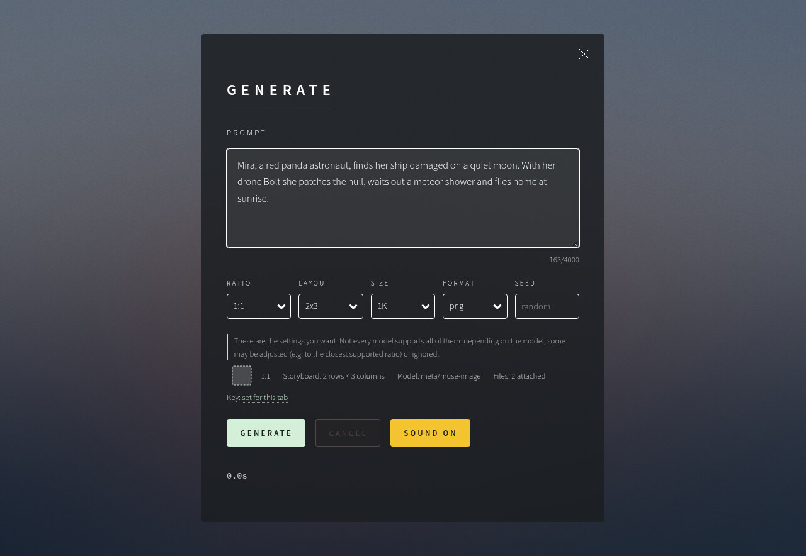
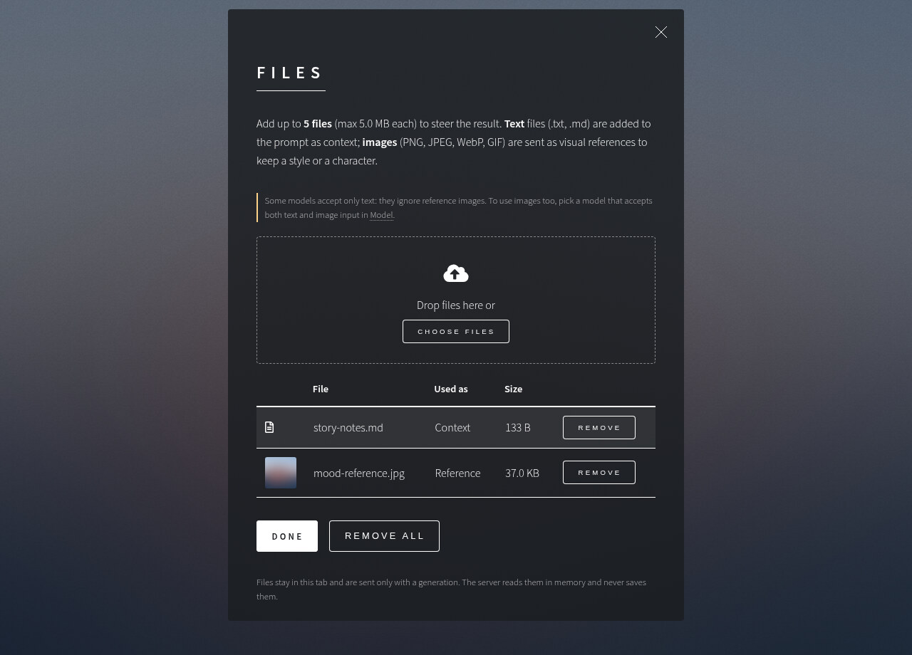
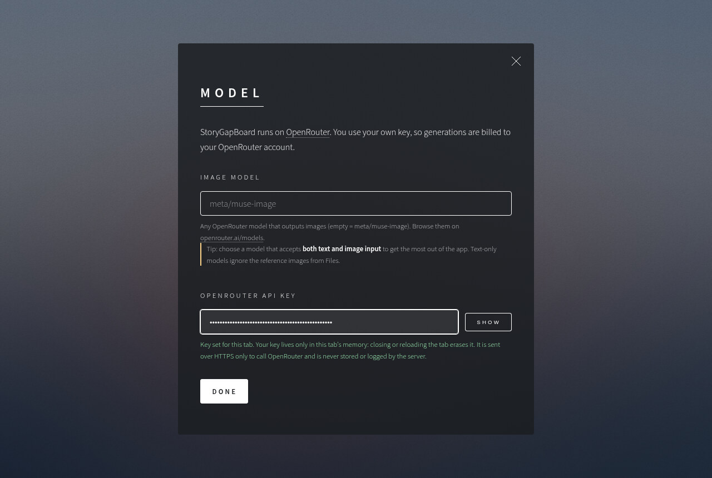
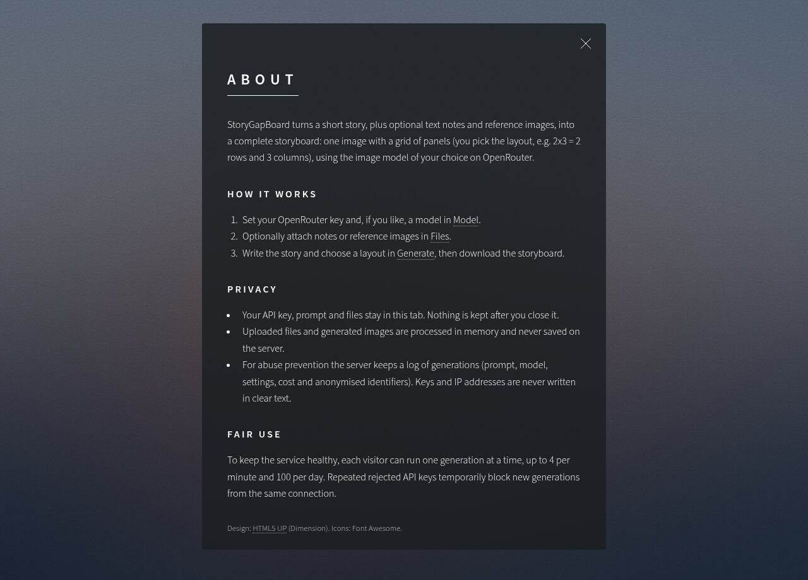
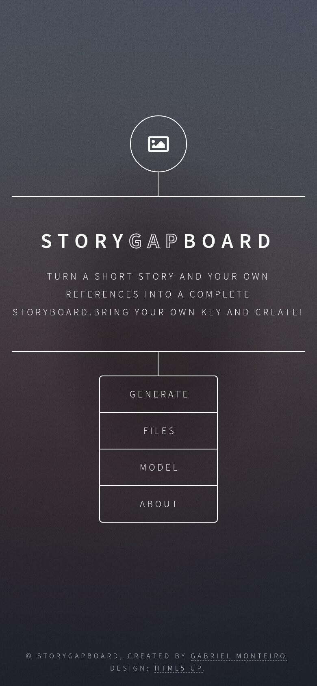

# StoryGapBoard

🎬 Turn a short story, plus optional notes and reference images, into a **storyboard**: one image with a grid
of panels, made by any image model on [OpenRouter](https://openrouter.ai). Visitors use their own API key.



## ✨ Features

- ✍️ **Generate**: story prompt, ratio, layout (1x3, 1x6, 2x1, 2x2, 2x3, 3x1, 3x2), size, format and seed.
- 🖼️ **One storyboard per generation**, downloaded straight to your browser.
- 📎 **Files**: up to 5 files (5 MB each).
  - 📝 `.txt` / `.md` → story context
  - 🎨 PNG / JPEG / WebP / GIF → visual references
- 🤖 **Model**: any OpenRouter image model.
- ℹ️ **About**: how it works, privacy and fair use.

## 📸 Screenshots

| Generate | Files |
|---|---|
|  |  |
| **Model** | **About** |
|  |  |

<p align="center"></p>

## 🔒 Privacy & security

- 🔑 The API key lives only in the open tab: never stored, never logged.
- 🧠 Files and images are processed in memory, never saved.
- 📊 The server keeps a private generation log with hashed IDs only (no keys, no raw IPs).
- 🛡️ Rate limits, one running generation per visitor, lock after repeated bad keys, strict security headers.

## 🚀 Run locally

Needs Python 3.10+ and Node.js 20.19+ / 22.12+.

```bash
./deploy.sh local          # http://localhost:8080 (Ctrl+C stops it)
```

## 📦 Deploy

- ⚙️ GitHub Actions tests, builds and ships a ready release to the server.
- 🧰 Nothing to install on the server: `deploy.sh` brings its own Python and sets everything up.
- ↩️ Automatic rollback if a new release fails its health check.
- 🌐 Served through Caddy with HTTPS, working alongside other apps without touching them; Cloudflare supported.
- 🗝️ Settings come from GitHub secrets/variables.

## 🛠️ Development

```bash
python3 -m venv .venv && .venv/bin/pip install -r backend/requirements-dev.txt
cd backend && ../.venv/bin/python -m unittest discover -s tests -t .   # tests
../.venv/bin/uvicorn app.main:app --reload                              # API on :8000
cd ../frontend && npm install && npm run dev                            # UI on :5173
```

## 🙏 Credits

StoryGapBoard created by [Gabriel Monteiro](https://krosct.github.io/).

Design: [Dimension by HTML5 UP](https://html5up.net) (CCA 3.0, see `LICENSE.txt`). Icons: Font Awesome Free.
